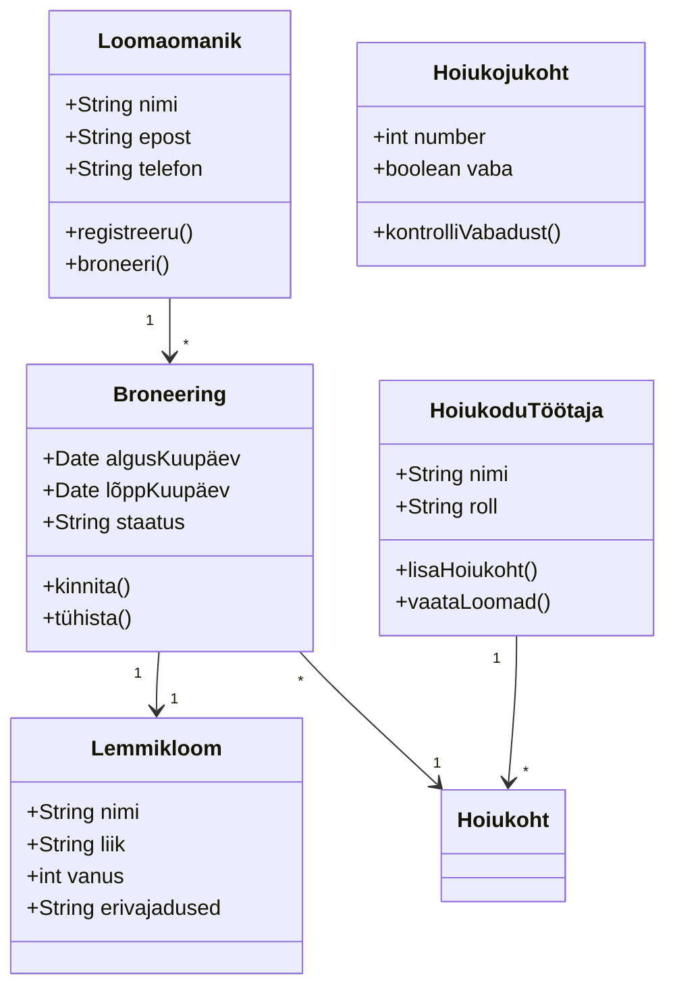
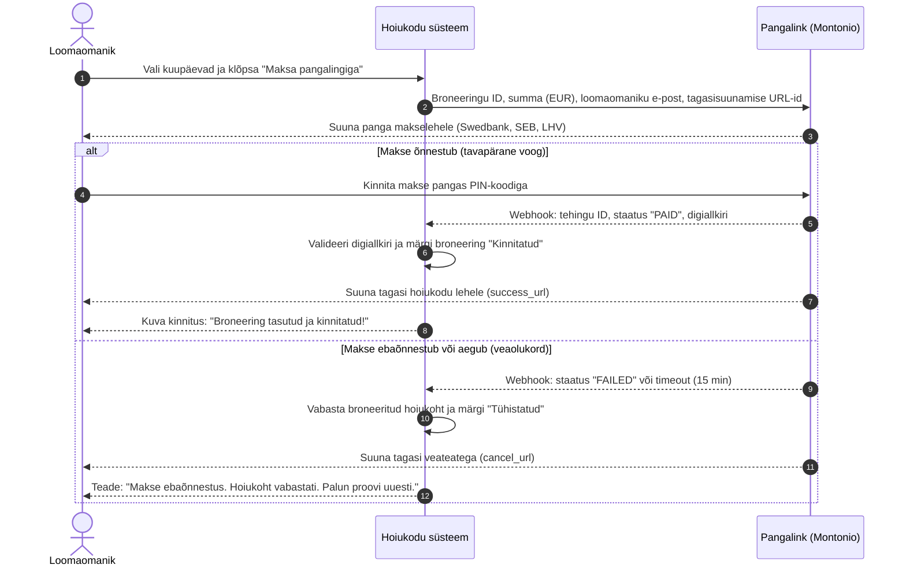

# Lemmikloomade hoiukodu

Süsteem, mis aitab loomaomanikel broneerida oma lemmikule hoiukoha
ajaks, mil nad ise kohal ei ole, ning hoiukodul jälgida, kes ja millal
loomi hoiule toob.

**Tegija:** [Alex Tarakanov]

## Kasutajad ja nõuded
Kaks rolli: loomaomanik ja hoiukodu töötaja. Kuus kasutajalugu on
Issues all, tähtsamad on märgitud `must`.

## Arendusmudel
Töötan inkrementaalselt: kõigepealt vabade kohtade nägemine ja
broneerimine, siis tühistamine ja töötaja vaade, viimasena
meeldetuletused. Nii saan iga osa valmimise järel süsteemi juba
kasutada ja järgmisi samme kohandada. Kosemudel ei sobi, sest kõiki
nõudeid pole alguses täpselt teada — näiteks pole selge, kas
meeldetuletused üldse vajalikud on, ja seda selgub alles kasutamise
käigus.

## Diagrammid

### Liidestuse skeem (Pangalingiga maksmine)

## Makett
Tegin ekraanid iteratiivselt, sest tahtsin kohe näha, kuidas
broneerimine ja loomade nimekiri kokku sobivad.

  
## Kuidas ma töötasin
Tahvel alguses ja lõpus: `protsess/`. 
[Ekraani paigutuse väljamõtlemine oli keeruline. Probleemid, mis olid märgitud kui "Kohustuslikud", olid kergesti lahendatavad. Ekraanipaigutuse väljamõtlemine oli keeruline. „Kohustuslikuks“ olid probleemid kergesti lahendatavad. Mudel valiti välja suuremate raskusteta.]
