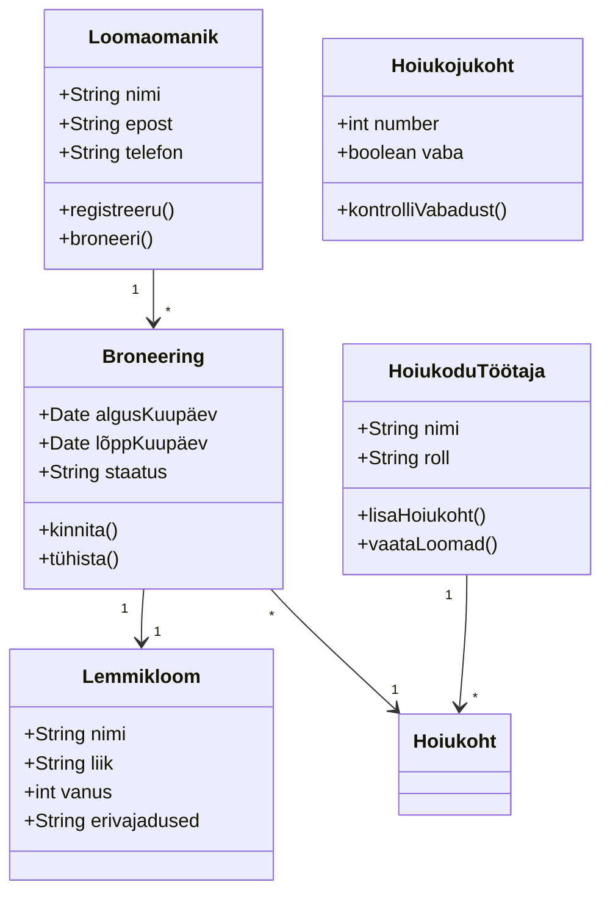
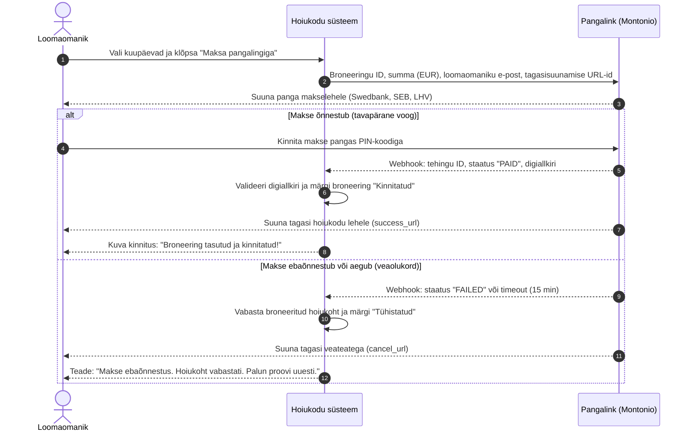
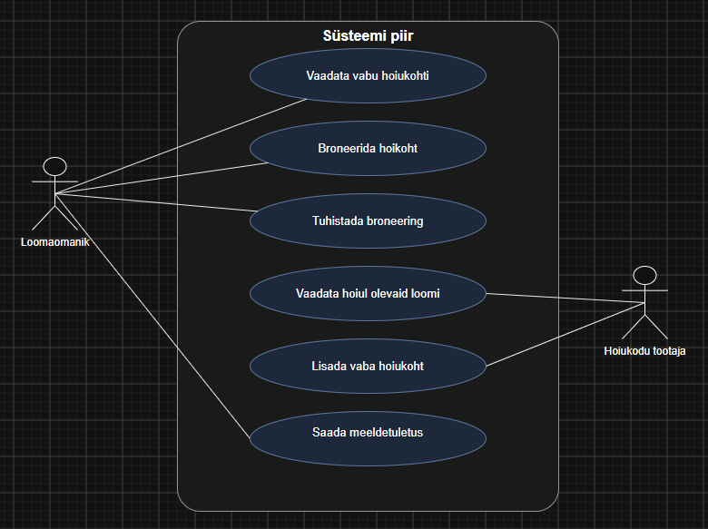
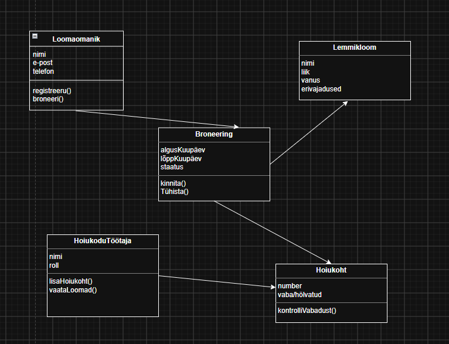
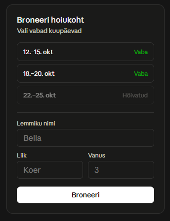
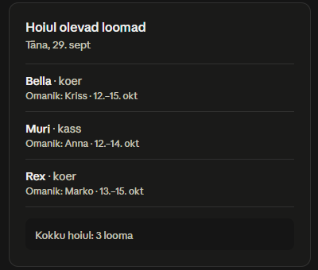
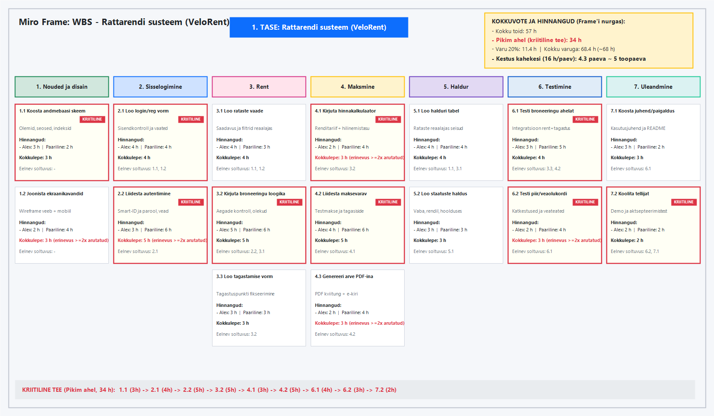

# Lemmikloomade hoiukodu

Süsteem, mis aitab loomaomanikel broneerida oma lemmikule hoiukoha
ajaks, mil nad ise kohal ei ole, ning hoiukodul jälgida, kes ja millal
loomi hoiule toob.

**Tegija:** [Alex Tarakanov]

## Kasutajad ja nõuded
Kaks rolli: loomaomanik ja hoiukodu töötaja. Kuus kasutajalugu on
Issues all, tähtsamad on märgitud `must`.

## Arendusmudel
Töötan inkrementaalselt: kõigepealt vabade kohtade nägemine ja
broneerimine, siis tühistamine ja töötaja vaade, viimasena
meeldetuletused. Nii saan iga osa valmimise järel süsteemi juba
kasutada ja järgmisi samme kohandada. Kosemudel ei sobi, sest kõiki
nõudeid pole alguses täpselt teada — näiteks pole selge, kas
meeldetuletused üldse vajalikud on, ja seda selgub alles kasutamise
käigus.

## Diagrammid

### Liidestuse skeem (Pangalingiga maksmine)

## Makett
Tegin ekraanid iteratiivselt, sest tahtsin kohe näha, kuidas
broneerimine ja loomade nimekiri kokku sobivad.

## Kuidas ma töötasin
Tahvel alguses ja lõpus: `protsess/`. 
[Ekraani paigutuse väljamõtlemine oli keeruline. Probleemid, mis olid märgitud kui "Kohustuslikud", olid kergesti lahendatavad. Ekraanipaigutuse väljamõtlemine oli keeruline. „Kohustuslikuks“ olid probleemid kergesti lahendatavad. Mudel valiti välja suuremate raskusteta.]
# Rattarendi süsteem (VeloRent)

## Projekti kaart

**Tellija:** VeloRent OÜ juhataja (Marko Tamm), kes vastutab linnarataste laenutusvõrgu ja klienditeeninduse igapäevase toimimise eest.

**Probleem:** Praegu toimub linnarataste laenutamine ja haldus käsitsi paberkandjal ning telefoni teel, mistõttu administraator kulutab kõnedele ja registreerimisele üle 2 tunni päevas. Tipptundidel tekivad järjekorrad ning nädalas läheb kaduma või tekitab segadust 3–4 broneeringut, kuna info rataste saadavuse kohta ei ole reaalajas kättesaadav.

**Eesmärk:** 1. detsembriks 2026 saavad linna elanikud ja turistid broneerida ning laenutada rattaid iseseisvalt veebis ilma administraatori vahenduseta; esimesel kuul sooritatakse vähemalt 200 edukat renditehingut; administraatori telefonikõnede aeg väheneb alla 15 minuti päevas ning kadunud broneeringute arv on 0.

**Tulemus:**
1. Töötav ja reageeriv veebipõhine rattarendi infosüsteem (klientidele ja haldurile).
2. Andmebaas ja API rataste ning renditehingute reaalajas haldamiseks.
3. Integreeritud turvaline autentimine ja pangalingi makse testliides.
4. Administraatori juhtpaneel rataste reaalajas seisundite ja tehingute jälgimiseks.
5. Paigaldus- ja seadistusjuhend koos tehnilise dokumentatsiooniga GitHubis.
6. Läbiviidud kasutajakoolitus administraatorile ja ametlik üleandmisakt.

**Ulatus SEES:**
1. Kasutajakonto loomine ja sisselogimine (sh parooli ja Smart-ID tugi).
2. Rataste kataloog, saadavuse kontroll ja broneerimine veebis.
3. Renditasu automaatne kalkuleerimine ja maksmise liidestus (test-pangalink).
4. Ratta tagastamise fikseerimine ja renditehingu automaatne lõpetamine.
5. Halduri vaade: ülevaade vabadest, renditud ja remondis olevatest ratastest.

**Ulatus VÄLJAS:**
1. Eraldiseisev emakeelne mobiilirakendus (iOS / Android Native) — esimeses etapis on süsteem ainult mobiilisõbralik veebirakendus (Responsive Web).
2. Rataste reaalajas GPS-jälgimine riistvaraseadmetega — rataste asukohta hallatakse rendijaamade ja punktide põhiselt.
3. Rataste füüsiline laohaldus, varuosade logistika ja palgaarvestus — süsteem katab ainult klientide rendiprotsessi.

**Kolmnurk:**
- Aeg: **Fikseeritud** (tähtaeg on rangelt 3 nädalat / 1. detsember).
- Raha / Inimesed: **Fikseeritud** (meeskonnas on täpselt 2 arendajat, täiendavat eelarvet pole).
- Ulatus: **Paindlik** (põhifunktsioonid ehk MVP tehakse esimesena, mittekriitilised lisamoodulid saab vajadusel edasi lükata).
- **Fikseeritud on:** Aeg ja Raha/Inimesed.

**Rollid:**
- **Tellija:** Marko Tamm (VeloRent OÜ juhataja) — määrab ärivajadused, eelarve ja ulatuse piirid; võtab tulemuse vastu.
- **Projektijuht:** Alex Tarakanov — vastutab ajakava, skoobi haldamise, riskide ennetamise ja tellijaga suhtlemise eest.
- **Meeskond:** Alex Tarakanov (täisarendaja / arhitekt) ja Paaristöötaja (täisarendaja / testija) — teevad analüüsi, disaini, koodi ja testimise.
- **Huvipooled:** Linnakodanikud ja turistid (ratta laenutajad), administraatorid/tehnikud (kes rattaid hooldavad), raamatupidaja (finantsarvestus).

| Risk | Tõenäosus 1–3 | Mõju 1–3 | Mida teeme enne (Ennetus) |
|---|---|---|---|
| 1. Paariline haigestub või ei saa sprindi keskel osaleda | 2 | 2 | Kõik ülesanded kirjeldatakse detailselt GitHub Issues'ina, kood committitakse ja sünkroonitakse iga päev reposse, et teine saaks tööd sujuvalt jätkata. |
| 2. Smart-ID või välise makseliidese testkeskkond tõrgub | 2 | 3 | Jätame süsteemi alles lihtsa parooliga sisselogimise ja testmakse simulaatori (fallback) ning teeme liidestuse esimese nädala alguses. |
| 3. Töömahu esialgne hinnang osutub 2x liiga lühikeseks | 3 | 2 | Lisame ajakavale 20% varuaega, jagame tööd väikesteks 1–8 h ülesanneteks ning lepime kokku range MVP skoobi, mida saab vajadusel kärpida. |

**Edukriteerium:** Tellija teeb vastuvõtutesti käigus testkeskkonnas iseseisvalt 5 ratta broneeringut ja tagastust veebis ning kinnitab, et administraatori juhtpaneelis kajastuvad rataste seisud reaalajas korrektselt (Jah / Ei).

**Hinnang:** 68 h, 5 päeva kahekesi.

---

## Tööde jaotus (WBS) ja hinnangud

### WBS 3-tasemeline struktuur ja ülesanded

#### Tase 1: Rattarendi süsteem (VeloRent)

#### Tase 2 ja Tase 3 (Tulemused ja Ülesanded):

1. **Nõuded ja disain**
   - 1.1. Koosta andmebaasi skeem ja olemite kirjeldus
     - Hinnang: Alex 3 h / Paariline 2 h | **Kokkulepe: 3 h** (koos seoste ja indeksitega)
     - Sõltuvus: -
   - 1.2. Joonista broneerimise ja tagastamise ekraanide kavandid (wireframe)
     - Hinnang: Alex 2 h / Paariline 4 h | **Kokkulepe: 3 h** *(erinevus ≥2x läbi räägitud: lepiti kokku ka mobiilivaate visandamine)*
     - Sõltuvus: -

2. **Sisselogimine ja autentimine**
   - 2.1. Loo kasutaja registreerimise ja sisselogimise vorm
     - Hinnang: Alex 4 h / Paariline 4 h | **Kokkulepe: 4 h** (koos sisendite valideerimisega)
     - Sõltuvus: 1.1, 1.2
   - 2.2. Liidesta autentimismehhanism (parool ja Smart-ID tugi)
     - Hinnang: Alex 3 h / Paariline 6 h | **Kokkulepe: 5 h** *(erinevus ≥2x läbi räägitud: lepiti kokku koos veahaldustestidega)*
     - Sõltuvus: 2.1

3. **Ratta rentimine ja broneerimine**
   - 3.1. Loo rataste nimekirja ja filtrite vaade
     - Hinnang: Alex 4 h / Paariline 3 h | **Kokkulepe: 4 h** (saadavuse reaalajas kuvamine)
     - Sõltuvus: 1.1, 1.2
   - 3.2. Kirjuta ratta broneerimise loogika ja kattuvuste kontroll
     - Hinnang: Alex 5 h / Paariline 6 h | **Kokkulepe: 5 h** (broneeringu olekute kontroll andmebaasis)
     - Sõltuvus: 2.2, 3.1
   - 3.3. Loo ratta tagastamise ja staatuse uuendamise vorm
     - Hinnang: Alex 3 h / Paariline 3 h | **Kokkulepe: 3 h** (ratta tagastuspunkti valikuga)
     - Sõltuvus: 3.2

4. **Maksmine ja arved**
   - 4.1. Kirjuta rendihinna kalkulaatori moodul
     - Hinnang: Alex 2 h / Paariline 4 h | **Kokkulepe: 3 h** *(erinevus ≥2x läbi räägitud: lisandus hilinemistasu arvestus)*
     - Sõltuvus: 3.2
   - 4.2. Liidesta pangalingi testmakse värav
     - Hinnang: Alex 4 h / Paariline 6 h | **Kokkulepe: 5 h** (makse õnnestumise ja tõrgete tagasiside)
     - Sõltuvus: 4.1
   - 4.3. Genereeri rendikinnitus ja arve PDF-ina
     - Hinnang: Alex 2 h / Paariline 4 h | **Kokkulepe: 3 h** *(erinevus ≥2x läbi räägitud: lepiti kokku koos e-kirja teavituse malliga)*
     - Sõltuvus: 4.2

5. **Halduri vaade**
   - 5.1. Loo administraatori ülevaatetabel rataste seisudest
     - Hinnang: Alex 4 h / Paariline 4 h | **Kokkulepe: 4 h** (reaalajas seisundite tabel)
     - Sõltuvus: 1.1, 3.1
   - 5.2. Loo ratta lisamise ja staatuse muutmise vorm haldurile
     - Hinnang: Alex 3 h / Paariline 3 h | **Kokkulepe: 3 h** (vaba / rendil / hoolduses olekud)
     - Sõltuvus: 5.1

6. **Testimine**
   - 6.1. Testi broneeringu ja tagastuse põhiahelat (integratsioonitest)
     - Hinnang: Alex 3 h / Paariline 5 h | **Kokkulepe: 4 h** (päringute ja vaadete koostoime testimine)
     - Sõltuvus: 3.3, 4.2
   - 6.2. Testi makse ja tagastuse piirsituatsioone ning veaolukordi
     - Hinnang: Alex 2 h / Paariline 4 h | **Kokkulepe: 3 h** *(erinevus ≥2x läbi räägitud: lepiti kokku katkestatud maksete kontroll)*
     - Sõltuvus: 6.1

7. **Dokumentatsioon ja üleandmine**
   - 7.1. Koosta administraatori kasutusjuhend ja paigaldusjuhend reposse
     - Hinnang: Alex 3 h / Paariline 2 h | **Kokkulepe: 3 h** (README ja seadistamise sammud)
     - Sõltuvus: 6.1
   - 7.2. Vii läbi süsteemi demonstratsioon ja koolitus tellijale
     - Hinnang: Alex 2 h / Paariline 2 h | **Kokkulepe: 2 h** (aktsepteerimistest ja üleandmine)
     - Sõltuvus: 6.2, 7.1

---

### Sõltuvuste analüüs ja pikim ahel (Kriitiline tee)

Kriitiline tee algusest lõpuni (pikim ahel, mida ei saa paralleelselt lühendada):
$$1.1\,(3\text{ h}) \rightarrow 2.1\,(4\text{ h}) \rightarrow 2.2\,(5\text{ h}) \rightarrow 3.2\,(5\text{ h}) \rightarrow 4.1\,(3\text{ h}) \rightarrow 4.2\,(5\text{ h}) \rightarrow 6.1\,(4\text{ h}) \rightarrow 6.2\,(3\text{ h}) \rightarrow 7.2\,(2\text{ h})$$

- **Pikima ahela kestus:** $3 + 4 + 5 + 5 + 3 + 5 + 4 + 3 + 2 = 34\text{ h}$

### Kokkuvõte (Miro frame'i nurka):
- **Kokku:** 57 h
- **Pikim ahel:** 34 h
- **Varu 20 %:** 11.4 h (ümmardatult 11 h)
- **Kokku varuga:** 68.4 h (ümmardatult 68 h)
- **Kestus kahekesi (16 h päevas meeskonna peale):** $68.4 / 16 \approx 4.3$ ehk **5 tööpäeva**.
